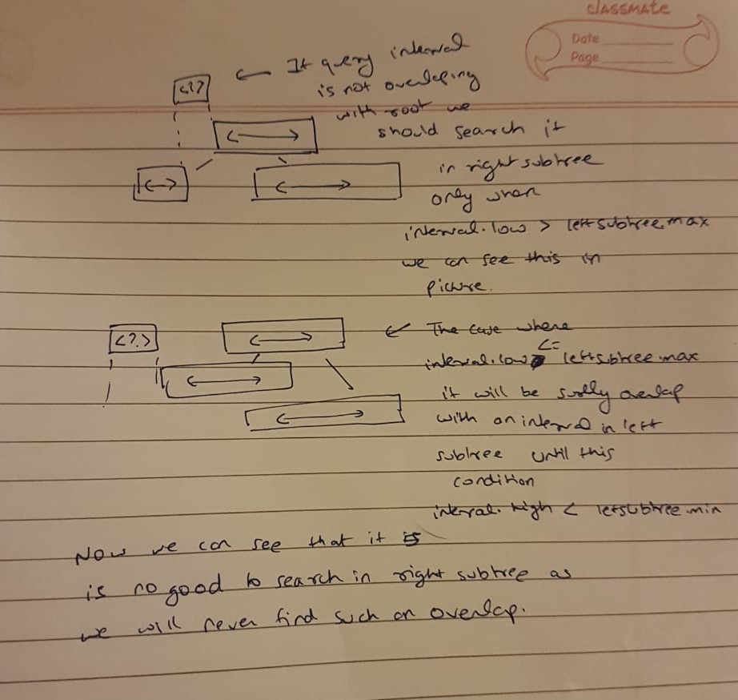

1. The tree obeys in the min (or max) heap property
2. An inorder traversal of the nodes yields the values in the same order in which they appear in the initial sequence.
3. Not a height-balanced tree.
4. Cartesian tree of a sequence of distinct numbers is always unique.

