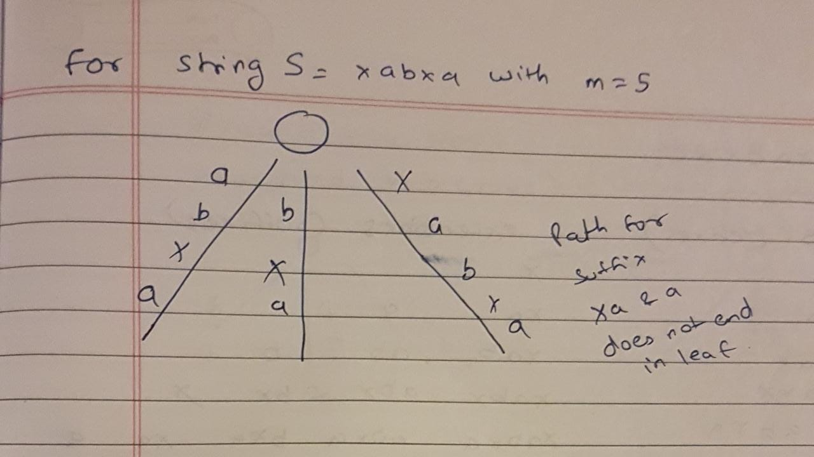
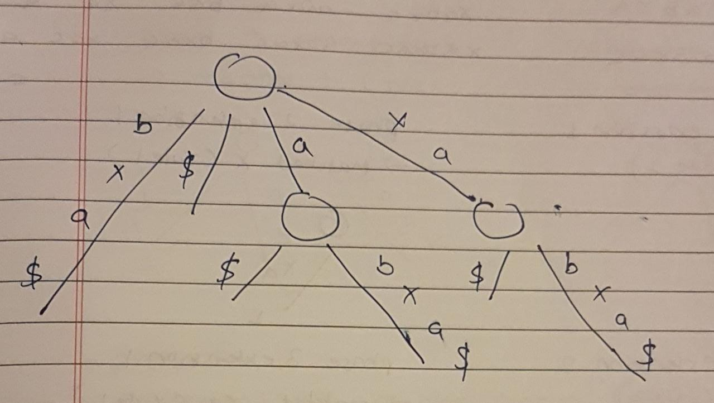
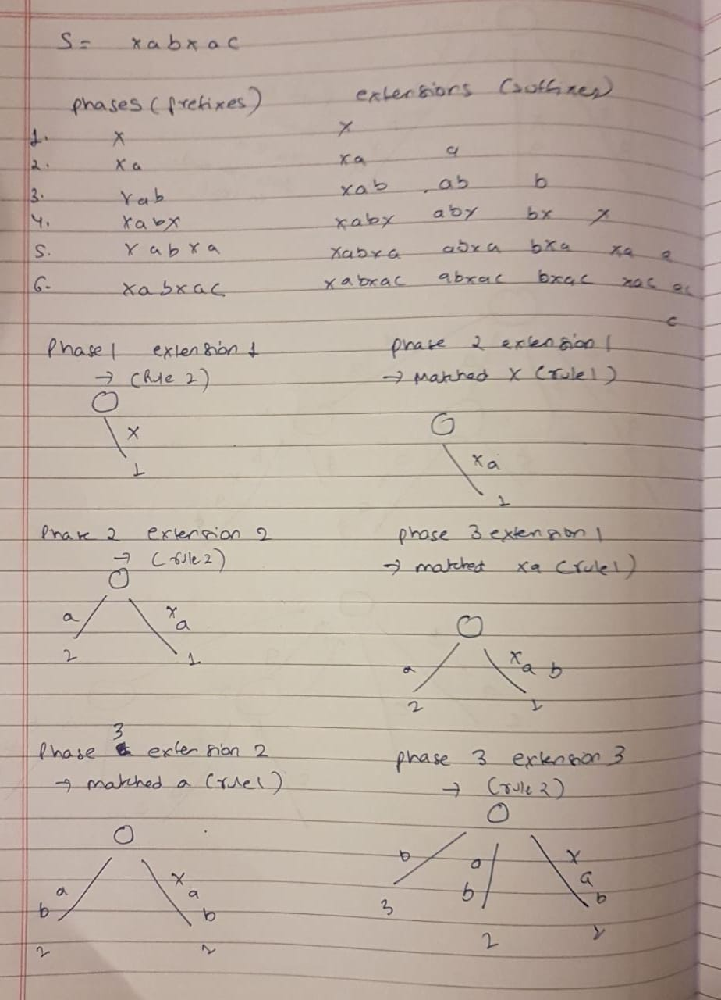
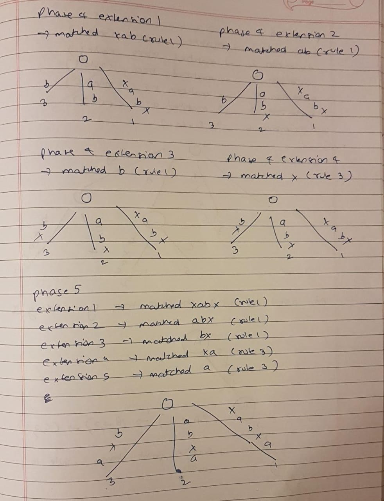
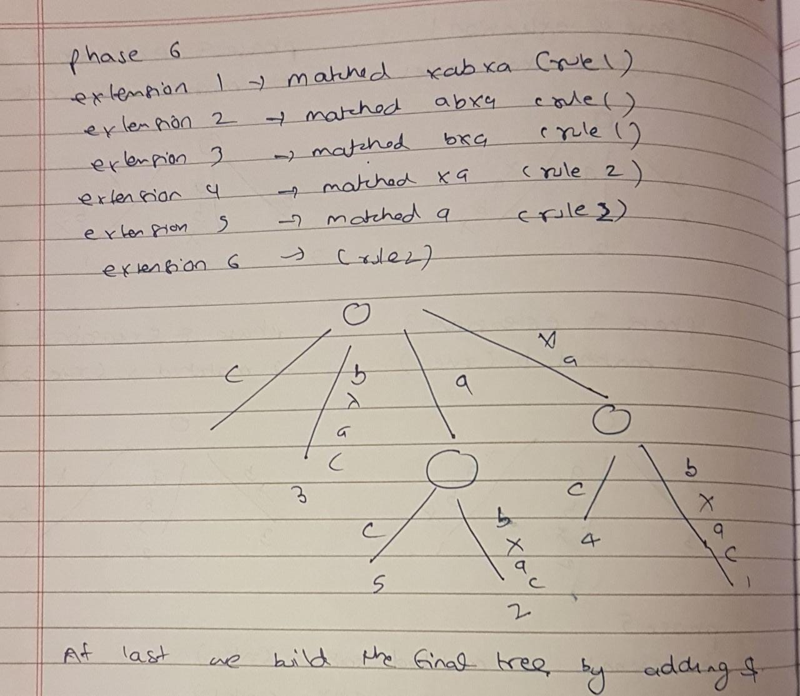
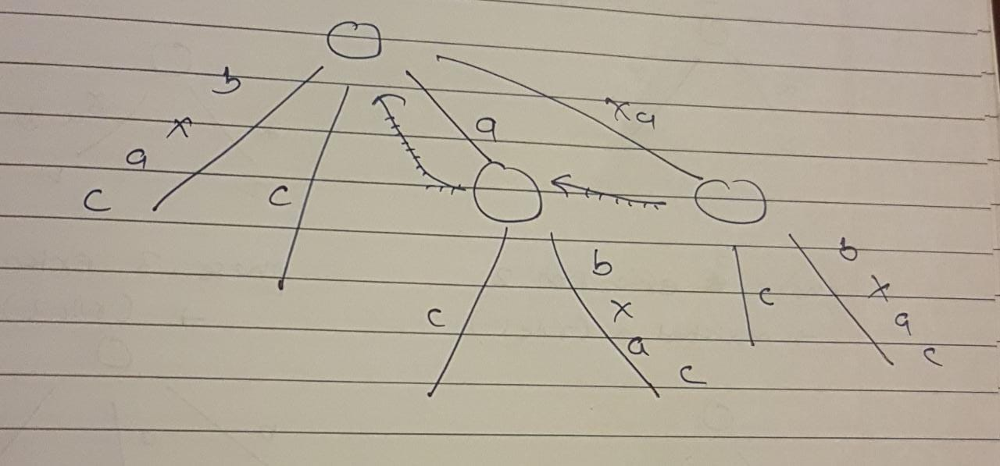
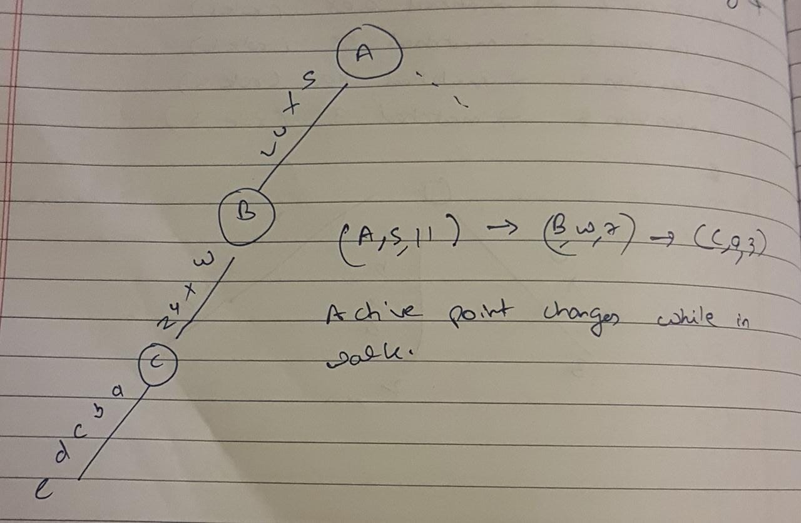

If one suffix of `S`(a string) matches a prefix of another suffix of `S` (when last character in not unique), then 
path for that suffix would not end at a leaf.

Here we will have 5 suffixes: xabxa, abxa, bxa, xa and a. Path for suffixes ‘xa’ and ‘a’ do not end at a leaf. It is 
called **implicit suffix tree** as some suffixes are not seen explicitly in tree. To avoid this problem, we add a 
character which is not present in string already. We normally use `$`, `#` etc as termination characters.

To get implicit suffix tree from a suffix tree.
* Remove all terminal symbol $ from the edge labels of the tree.
* Remove any edge that has no label
* Remove any node that has only one edge going out of it and merge the edges.

### Ukkonen Suffix Tree

Ukkonen’s algorithm constructs an implicit suffix tree `Ti` for each prefix `S[l ..i]` of `S` (of length `m`). It first 
builds `T1` using 1st character, then `T2` using 2nd character, then `T3` using 3rd character, …, `Tm` using `mth` 
character. Implicit suffix tree `Ti+1` is built on top of implicit suffix tree `Ti`. The true suffix tree for `S` is 
built from `Tm` by adding `$`.

At any time, Ukkonen's algorithm builds the suffix tree for characters seen so far and so it has **online** property. 
Time taken is `O(length)`. Ukkonen’s algorithm is divided into `m` phases (one phase for each character in the string 
with length `m`).

We loop for all prefixes(phases) and then to suffixes for each phase(extensions). Suffix extension is all about adding 
the next character into the suffix tree built so far. In extension `j` of phase `i+1`, algorithm finds the end of 
`S[j..i]`, which is already in the tree due to previous phase `i`, and then it extends `S[j..i]` to be sure the suffix 
`S[j..i+1]` is in the tree.

Rules to add extensions.
1. If the path from the root labelled `S[j..i]` ends at leaf edge(i.e. `S[i]` is last character on leaf edge) then 
character `S[i+1]` is just added to the end of the label on the leaf edge. Rule 1 adds a new character on existing leaf 
edge
2. If the path from the root labelled `S[j..i]` ends at non-leaf edge(i.e. there are more characters after `S[i]` on 
path) and next character is not `S[i+1]`, then a new leaf edge is created starting from character `S[i+1]`. A new 
internal node will also be created if `S[1..i]` ends inside(in-between) a non-leaf edge. Rule 2 creates a new leaf edge 
(And may also create new internal node, if the path label ends in between an edge)
3. If the path from the root labelled `S[j..i]` ends at non-leaf edge(i.e, there are more characters after `S[i]` on 
path)and next character is `S[i+1]` (already in tree), do nothing. Rule 3 ends the current phase (when current character 
is found in current edge being traversed)

**Suffix links**

For an internal node `v` with path-label `xA`, where `x` is a single character and `A` is a substring(can be empty), if 
there is another node `s(v)` with path-label `A`, then a pointer from `v` to `s(v)` is called a suffix link.  If `A` is 
empty string, suffix link from internal node will go to root node. There will not be any suffix link from root node(it's 
not considered as internal node).

**How suffix link speeds up?**

Take previous example for phase 6 extension 1(xabxac). Now for extension 2(abxac) we just have to move one node up and 
use the suffix link to find the matching characters from root.

**Trick 1(Skip/Count)**

When walking down from node `s(v)` to leaf, instead of matching path character by character as we travel, we can 
directly skip to the next node if number of characters on the edge is less than number of characters we need to travel. 
If number of characters on the edge is more that the number of characters we need to travel, we directly skip to the 
last character on that edge(it is an implicit tree). If implementation is such a way that number of characters on any 
edge, character at a given position in string `S` should be obtained in constant time, then skip/count trick will do 
that walk down in proportional to the number of nodes on it rather than the number of characters on it.

Using suffix link along with skip/count trick, suffix tree can be built in `O(m^2)` as there are m phases and each phase 
takes `O(m)`.

**Edge-label compression**

So far, path labels are represented as characters in string. Such a suffix tree will take `O(m^2)` space to store the path
labels. To avoid this, we can use two pair of indices(start, end) on each edge for path labels, instead of substring itself.
The indices start and end tells the path label start and end position in  string `S`. With this, suffix tree needs `O(m)` 
space.

**Trick 2**

When rule 3 applies in any extension `j` of phase `i+1`, then it will also apply in all further extensions of same phase. 
That's because if path labelled `S[j.i]` continues with character `S[i+1]`, then path labelled `S[j+1..i]`, `S[j+2..i]`, 
`S[j+3..i]`, ... ,`S[i..i]` will also continue with character `S[i+1]`. Stop the processing of any phase as soon as rule 
3 applies. All further extensions are already present in tree implicitly.

**Trick 3**

In any phase `i`, leaf edges may look like `(p, i)`, `(q, i)`, `(r, i)`, …. where `p`, `q`, `r` are starting position of 
different edges and `i` is end position of all. Then in phase `i+1`, these leaf edges will look like `(p, i+1)`, 
`(q, i+1)`, `(r, i+1)`,…. This way, in each phase, end position has to be incremented in all leaf edges. For this, we 
need to traverse through all leaf edges and increment end position for them. To do same thing in constant time, maintain 
a global index e and e will be equal to phase number. So now leaf edges will look like `(p, e)`, `(q, e)`, `(r, e)`. In 
any phase, just increment `e` and extension on all leaf edges will be done.

**Observations**
* At the end of any phase `i`, there are at most `i` leaf edges (if ith character is not seen so far, there will be `i` 
leaf edges, else there will be less than `i` leaf edges).
* If at all Rule 1 applies in any phase, it only applies in initial few phases continuously (say 1 to j). Rule 1 never 
applies later in a given phase once Rule 2 or Rule 3 is applied in that phase.

**Active point**

After phase `i`, if there are `j` leaf edges then in phase `i+1`, first `j` extensions will be done by trick 3. 
activePoint will be needed for the extensions from `j+1` to `i+1` and activePoint may or may not change between two 
extensions depending on the point where previous extension ends.

`activePoint`: This could be root node, any internal node or any point in the middle of an edge. This is the point where 
traversal starts in any extension. For the 1st extension of phase 1, `activePoint` is set to root. Other extension will 
get `activePoint` set correctly by previous extension (with one exception case APCFALZ discussed below) and it is the r
esponsibility of current extension to reset `activePoint` appropriately at the end, to be used in next extension where 
Rule 2 or Rule 3 is applied (of same or next phase). To accomplish this, we need a way to store `activePoint`. We will 
store this using three variables: `activeNode`, `activeEdge`, `activeLength`.
* `activeNode`: This could be root node or an internal node.
* `activeEdge`: When we are on root node or internal node and we need to walk down, we need to know which edge to choose. 
`activeEdge` will store that information. In case, `activeNode` itself is the point from where traversal starts, then 
`activeEdge` will be set to next character being processed in next phase.
* `activeLength`: This tells how many characters we need to walk down (on the path represented by `activeEdge`) from 
`activeNode` to reach the `activePoint` where traversal starts. In case, `activeNode` itself is the point from where 
traversal starts, then `activeLength` will be ZERO.

* **activePoint change for extension rule 3 (APCFER3)**: When rule 3 applies in any phase `i`, then before we move on to 
next phase `i+1`, we increment `activeLength` by `1`. There is no change in `activeNode` and `activeEdge`. Why? Because 
in case of rule 3, the current character from string `S` is matched on the same path represented by current 
`activePoint`, so for next `activePoint`, `activeNode` and `activeEdge` remain the same, only `activeLength` is 
increased by 1 (because of matched character in current phase). This new `activePoint` (same node, same edge and 
incremented length) will be used in phase `i+1`.

* **activePoint change for walk down (APCFWD)**: at any time, the closest internal node from the point, where we want to
reach, should be the activePoint. Why? This will minimize the length of traversal in the next extension.

* **activePoint change for Active Length ZERO (APCFALZ)**: Let’s consider an activePoint (A, s, 0). And let’s say current 
character being processed from string S is ‘x’ (or any other character). At the start of extension, when activeLength is 
ZERO, activeEdge is set to the current character being processed, i.e. ‘x’, because there is no walk down needed here 
(as activeLength is ZERO) and so next character we look for is current character being processed.

* **activePoint change for extension rule 2 (APCFER2)**:
    * Case 1 (APCFER2C1): If `activeNode` is root and `activeLength` is greater than ZERO, then decrement the 
    `activeLength` by 1 and `activeEdge` will be set `S[i – remainingSuffixCount + 1]` where `i` is current phase number.
    * Case 2 (APCFER2C2): If `activeNode` is not root, then follow the suffix link from current `activeNode`. The new 
    node (which can be root node or another internal node) pointed by suffix link will be the `activeNode` for next 
    extension. No change in `activeLength` and `activeEdge`.